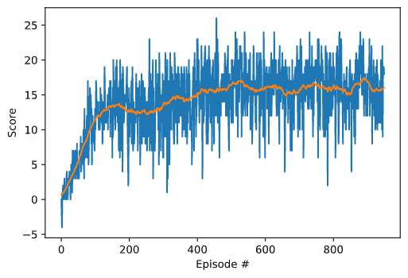

# Summary

In this report I present the implemented algorithms along with the training results and ideas for future work.

# Algorithms
## Action selection
The action selection follows the epsilon greedy policy: it picks the current best option ("greedy") with high probability, and picks a random action with a small (epsilon) probability.

## Deep Q-Networks (DQN)
Using neural networks instead of Q-Tables allows us to expand the size of the problems that we can solve with reinforcement learning. DeepMind even [managed](http://files.davidqiu.com//research/nature14236.pdf) to implement an agent that can play Atari games on a human-like leve by leveraging a DQN.

The agents in this project will also use a DQN as a basis along with two key features, addressing the [notorious instabilities](http://citeseerx.ist.psu.edu/viewdoc/download?doi=10.1.1.73.3097&rep=rep1&type=pdf) of neural networks when representing the action values:

- **Experience replay**: When an agent interacts with the environment, the sequence of experiences can be highly correlated - causing a risk of "getting swayed" by the effects of this correlation. Instead of learning from the experience sequential, an experience buffer is maintained which is than sampled randomly during training.
- **Fixed Q-Targets**: In Q-Learning, we update a guess with a guess, and this can potentially lead to harmful correlations. To avoid this, we can update the parameters by using a separate, fixed network that is not changed during the learning step.

For a detailed explanation, please refert to the DeepMind [paper](http://files.davidqiu.com//research/nature14236.pdf).

### Note
The agents presented in this solution uses a neural network with 2 hidden fully connected layer as follows: input layer (37 neurons) &rarr; fc1(64) &rarr; ReLU &rarr; fc2(64) &rarr; ReLU &rarr; output layer(4) except the ones with the dueling DQN structure.

## Double DQN
Vanilla DQN tends to overestimate the action value as is. To solve this, [Double DQN](https://arxiv.org/abs/1509.06461) was proposed. Double DQN uses two separate networks Q and Q'. Q is for selecting the best action a with maximum Q-value of next state, while for calculating expected Q-value, Q’ is used by using the action a selected in the previous step.

## Prioritized Experience Replay
The idea of [PER](https://arxiv.org/abs/1511.05952) is to prioritize experiences that may be more important than others. If we sample the experience buffer uniformly, we may "miss out" on experiences that occour less frequently, but contain important information (produce a bigger TD-error) and the agent could learn much from it.

## Dueling DQN
The [Dueling DQN](https://arxiv.org/abs/1511.06581) algorithm represents two separate estimators: one for the state value function and one for the state-dependent action advantage function by using two streams to separately estimate them.

# Results

The following table contains the tested agents with the episode number where they solved the task. With the default hyperparameters, the combination of Double and Dueling DQN solved the task (reached an average score of at least 13 over 100 consecutive episodes) in 247 episodes.

| Agent | Solved in # episodes | DoubleDQN | PER | Dueling |
|-------|----------------------|-----------|-----|---------|
| 1     | 303                  | No        | No  | No      |
| 2     | 306                  | No        | No  | Yes     |
| 3     | 355                  | No        | Yes | Yes     |
| 4     | 454                  | No        | Yes | No      |
| 5     | 326                  | Yes       | No  | No      |
| 6     | ***247***            | Yes       | No  | Yes     |
| 7     | 350                  | Yes       | Yes | Yes     |
| 8     | 340                  | Yes       | Yes | No      |

## Scores
The following plot shows the scores together with the moving average with a window size of 50:

## Hyperparameters
The hyperparamteres used by the agent are listed in the following table:

| Hyperparameter | Value   | Description                                             |
|----------------|---------|---------------------------------------------------------|
| BUFFER_SIZE    | 100000  | replay buffer size                                      |
| BATCH_SIZE     | 64      | batch size                                              |
| GAMMA          | 0.99    | discount factor                                         |
| TAU            | 0.001   | factor for soft update of the target network parameters |
| LR             | 0.0005  | learning rate                                           |
| UPDATE_EVERY   | 4       | how often to update the network                         |
| PRIO_ALPHA     | 0.6     | alpha, used by PER                                      |
| PRIO_BETA      | 0.4     | beta, used by PER                                       |
| PRIO_EPSILON   | 0.00005 | epsilon, used by PER                                    |
| eps_decay      | 0.987   | epsilon for the epsilon-greedy policy                   |

## Trained Model
The trained model is in [this file](./dueling_double_dqn.pth).

# Ideas for Future Work
**Experiment with different network structure**: The current network structure is just an example. I experimented with a few other ones, and selected the one that worked "the best" but further experiments could definitely lead to better performing structures.

**Explore the models parameter space**: in this project I focused on the implementation and first comparison of the algorithms presented int he course. I used the same hyperparameters for all agents and there is no garantee that those parameters are optimal. Therefore a systematic evaluation of the hyperparameters would be a good start, e.q. using grid search.

**Reward shaping**: An idea would be to rethink the reward system of the environment. As long as there are many bananas around the agents, it is "easy" to find and collect them. Later on, as the number of available bananas decrease, it is much harder to find a new banana therefore a bigger reward for those bananas could improve the performance of the agent.

**Noisy Networks**: This [paper](https://arxiv.org/abs/1706.10295) introduces a learning agent with parametric noise added to its weights, and shows that the induced stochasticity of the agent's policy can be used to aid efficient exploration.